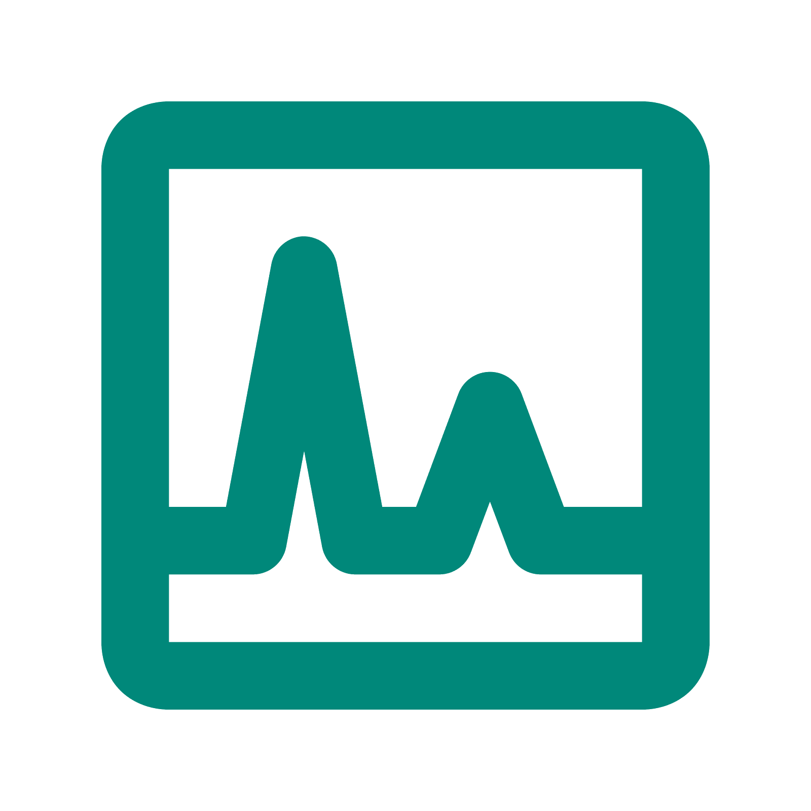

# CODESP

>Inserir uma logo para o projeto

>Site de matrícula na escolinha do CNAT

# Equipe e Formas de Contato

1. Nome...
2. Nome...

> Descrever as formas de contato da equipe - WhatsApp, Discord, etc.

# Reuniões Semanais da Equipe

1. Reunião com o orientaor OU reservada para apresentações - **"dia da semana", às "horário" no "local"**.

> Descrever dias, horários e local das demais reuniões da equipe

> [!TIP]
> Obs.: é fortemente recomendado que todas as reuniões da equipe sejam registradas na forma de tarefas (*issues*), contendo essencialmente informações como: presentes, temas discutidos e os encaminhamentos. Essas tarefas devem ser marcadas com o label correspondente.

# Documentação

Clique em cada um dos links abaixo para acessar o artefato específico.

1. [Documento de Visão](doc/visao/doc-visao.md)
1. [Protótipos de Interface com o Usuário](doc/prototipos/prototipos.md)
1. [Modelo de Casos de Uso](doc/cdu/cdu.md)
1. [Modelo de Domínio](doc/dominio/dominio.md)
1. [Modelo de Dados](doc/bd/bd.md)

# Manual da Desenvolvedor

[Orientações para os desenvolvedores do projeto](doc/guia-ds/guia.md)
