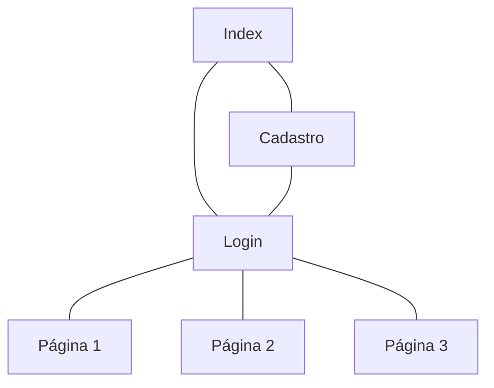
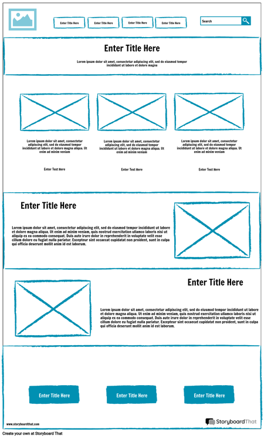

# Protótipos de Interface com o Usuário

## Histórico de Revisões

| Data | Versão | Descrição | Autores |
| :--: | :----: | :-------: | :-----: |
| - | - | Versão inicial |  - |
| - | - | - |  - |

## 1. Mapa do Site

> Obs.: propõem-se a utilização de alguma ferramenta que possibilite a representação textual do diagrama. como o seguinte exemplo:

### A. Tela 1: Index

> Obs. Substituir pela captura das imagens, sejam elas provenientes do Figma (anexar também o link para o Figma) ou já em HTML e CSS...

[LINK para Figma com o protótipo](#)

### B. Tela 2: Login

> Obs. Substituir pela captura das imagens, sejam elas provenientes do Figma (anexar também o link para o Figma) ou já em HTML e CSS...

[LINK para Figma com o protótipo](#)